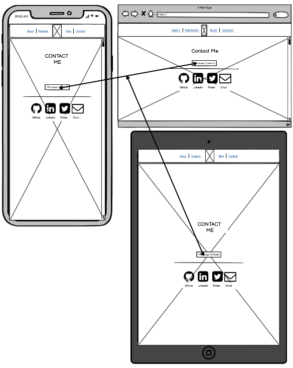

## **Portfolio Website - Si Yang (Justin) Cui**

**Portfolio: [Portfolio Link](https://jovial-lumiere-7b00dd.netlify.app/projects.html)**

**Github Repo: [Github Repo Link](https://github.com/Siyangcui/portfolio_T1A2)**

---

### **Purpose**

---

Currently a developer in training with previous experience in the IT industry, this portfolio aims to display my personality, skills and past experiences to prospective employers. This website also provides acts as a CI platform that will allow me to add to and refactor old code as i learn new things during the course.

### **Functionality and Features of the website**

---

- **Head Components**

1. Title
1. Author
1. Description
1. SRI
1. Icon

- **Navigation Bar**

The nav bar sits across all pages of the website which grants access to all other pages which provides ease of access for target audiences. The nav bar links include :

1. About
1. Projects
1. My personal Logo
1. Blog
1. Contact

The nav bar also has a faded opacity to allow a more aesthetic blending into the background image. When hovered over, a `:hover` effect will bring opacity to "1" allowing clear visibility of the contents of the nav bar.
The nav bar is also centered using flexbox to add aesthetics via symmetry. an `index-z` is also applied to sit the navbar above other content when scrolling.

- **Logo**

The Logo resides in the nav bar as mentioned above, its initial state of `opacity` is set to 0%. however there is an animation effect based on `opacity` with an `animation-iteration-count: infinite` that continously cycles the animation forever. This create the "breathing" effect on the logo which brings the logo's opacity from 0% to 100% then back down to 0%. This was aimed at drawing the audiences attention when viewing the website as there is no direct "home" button anywhere as the Logo is hyperlinked to the home page. This also leads the user to hover over the logo which ultimately will trigger the nav bar `:hover` effect in the aforementioned feature.

- **Background Image**

Background Image set to `cover`, `center`, `no-repeat` and `fixed` which sits the background image properly to cover the viewport without repeating. also the `fixed` property fixes the background image when scrolling to prevent scrolling out of view.

- **Theme**

Recurring "neon" theme is present across the website to incorporate personality and mood to the website. the neon theme is acheived by either a `box-shadow` or `text-shadow` to add the neon "illuminated" feel in conjunction the background image which has been credited to the owner.

- **Responsivness**

All pages of the porfolio website has `@media` queries that will resize based on content and viewport width

- **Home Page Content**

The content on the home page provides a quick capture of my name, my position and also links to some important socials. This increases productivity and efficiency of prospective employers allowing them to get to critical information instantly. This was done via flexbox to position the content right in the middle of the viewport.

- **Delayed Animation on Home Page**

As a web page loads with no content on the page, audience's focus will wander looking for elements to observe. To utilise this behaviour, a delayed `animation` effect has been applied to the content of the home page to allow the audiences to snap their focus on the content.
This was achieved by creating seperate containers for each letter of the name, whilst having seperate containers for the role and socials to allow for the delayed animation to target each element seperately.

- **Hover Effect on Social Icons - Home Page**

A `:hover` and `transform:scale` effect has been implemented on the social icons on the main page to add interaction to the interface. An `:after` pseudo element also incorporated to label each icon for clarity. Each link ultimately links to the corresponding social sites.

- **About Me Page - Bullet Points**

On the About Me page, to subtely incorporate the theme of the website `li` bullet points have been replaced with "&raquo;" and a `text-shadow` has been added.

- **About Me Page - Layout**

Layout has been designed in 4 sections via flexbox and background color with opacity set to help readability against background image.

1. Photo section: applied `justfied-content: flex-end` and will center based on `@media` query on viewport width. `Clip-path` applied to semi round out the profile picture.
1. About Me section which is set to 80% width of parent to allow for ease of reading for longer content.
1. Column Left which has sections and lists set to display `inline`
1. Column Right which has sections and lists set to display as `block`.

- **Projects Page - Layout**

The project page was kept simple to display containers that would house all my projects. The Layout of the boxes was achieved via flexbox and the `width` property to set each box's `min-width` to be 40% of the parent which is 80% of the viewport. This allows for a 2 box per row layout which is responsive.

- **Projects Page - Project Icon**

Icons for each project has a `:hover` effect to once again add interactivity. The icon image is hyperlinked to the project site.

- **Blog Page - Layout**

Using flexbox to achieve symmetry for content within main body container.

- **Blog Page - Light Bars**

Each post has a seperator designed in a form of a neon light thats shining over the blog post itself. This was achieved by creating a light bar `div` with `height: 2px` and `width: 60%` of parent. Additional styling includes a `border-radius: 100%` to create the sharp on outside and round towards the middle look. The 'neon' glow was applied by using `box-shadow` with different colors at different pixel sizes.

- **Blog Page - Blog Post Images**

Each image is wrapped in a container with a `overflow: hidden` property and value set. This is to maintain consistent size of overly large images disorientating the layout of the blog page with the width of the container set at 65% of the parent.

Each image that is wrapped inside the image wrapper container has a `:hover` pseudo element tied to a `transform:scale (1.2)` effect. this working in conjunction with the image wrapper container zooms in the image providing audience immersion whilst not disrupting the overall layout of the webpage.

- **Contact Page - Layout and Design**

This page is the most simplest of all as its purpose is not to distract the audience preventing them from accessing the methods of contact. As such, no animations or user interactions were designed, just a simple light bar once again to keep the theme of the website aligned.
Each icon links out to their respective websites, the email icon is a `mailto:` href which will open up the audience's mail application when clicked. A place holder email has been set currently.

### **Sitemap**

---

### **Screenshots**

---

#### **Home**

#### **About**

#### **Projects**

#### **Blog**

#### **Contact**

### **Target Audiences**

---

Target audiences for this portfolio are recruiters and prospective employers in the Technology industry or Developers. The website is aimed at showcasing my capabilities as a developer by incorporating technical foundations with my personality and the design aspect to deliver an immersive and representative image of my persona.

### **Wireframes**

---

**Browser**

**Mobile**

**Ipad**

**Revision**

Revised Contact Page to add message above Social Links and also a light bar.

### **Technology Stack Used**

---

- HTML
- CSS
- Inkscape
- Balsamiq Wireframes
- Git and Github
- Github Pages
